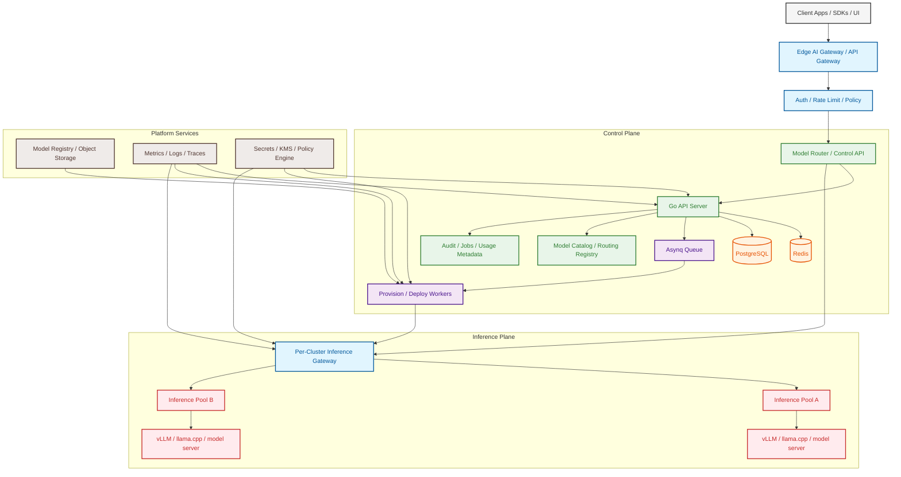

<div align="center">
  <h1>Tark</h1>
  <p><b>Enterprise Self-Hosted AI Platform & Control Plane</b></p>
  
  <p>
    <a href="https://golang.org/doc/go1.21"></a>
    <a href="https://kubernetes.io/"></a>
    <a href="https://github.com/hibiken/asynq"></a>
    <a href="#"></a>
    <a href="#"></a>
  </p>
</div>

---

**Tark** is a distributed, Go-based control plane for provisioning Kubernetes clusters, deploying model-serving workloads, and proxying inference requests through a single unified API surface. It decouples the management APIs from the GPU-backed inference execution, providing a secure, observable, and multi-tenant foundation for private AI infrastructure.

## 📑 Table of Contents

- [Key Features](#-key-features)
- [Architecture Overview](#-architecture-overview)
- [Design Principles](#-design-principles)
- [Getting Started](#-getting-started)
- [API Reference](#-api-reference)
- [Project Structure](#-project-structure)
- [Status & Roadmap](#-status--roadmap)

---

## 🚀 Key Features

- **Automated Infrastructure Provisioning**: Asynchronously provision clusters via Pulumi Automation API (Azure backend support).
- **Model Deployment Orchestration**: Automatically deploy models (vLLM, llama.cpp) to Kubernetes.
- **Universal Inference Proxy**: `POST /v1/chat/completions` directly routes to the active model backend.
- **Inference-Aware Load Balancing**: Dynamic service discovery using Redis with PostgreSQL durable fallback.
- **Durable Async Execution**: Redis-backed queue (`asynq`) for infrastructure tasks with prioritized workers.
- **Multi-Tenant Ready**: Abstracted organizational boundaries, API routing, and deployment tracking.

---

## 🏛️ Architecture Overview

Tark operates on a divided architecture, ensuring that traffic scaling at the gateway does not overload inference clusters, and management operations don't block token generation.



---

## 🧠 Design Principles

- **Control vs. Inference Plane**: Keep management APIs separated from GPU-backed inference.
- **Two-Tier Gateway Model**: Centralized edge gateway for auth/policy, and per-cluster gateways for model-aware balancing.
- **Inference-Aware Routing**: Route by model identity, upstream health, and cache locality.
- **Durable Orchestration**: Redis powers the queue, but PostgreSQL remains the absolute source of truth for deployments.
- **Security by Default**: Isolated tenant routing, encrypted kubeconfigs, and TLS boundaries.
- **Model Portability**: Compatible with diverse runtimes (vLLM, llama.cpp) behind a standard API contract.

---

## 🛠️ Getting Started

### Prerequisites

- **Go** (1.21+)
- **Docker & Docker Compose**
- **PostgreSQL & Redis**
- **Pulumi CLI** (with Azure credentials if provisioning infrastructure)
- **Kubernetes Access** (if deploying workloads)

### Local Development Setup

1. **Start local dependencies**
   ```bash
   docker compose up -d
   ```

2. **Apply migrations**
   At the moment migrations are manual. Apply the initial schema:
   `internal/store/migrations/001_init.sql`

3. **Run the API Server**
   ```bash
   go run ./cmd/server
   ```

4. **Run the Background Worker**
   ```bash
   go run ./cmd/worker
   ```

---

## 📡 API Reference

**Management API**
- `POST /api/provision` - Asynchronously provision infrastructure.
- `POST /api/deploy` - Deploy a model bundle.
- `POST /api/destroy` - Tear down cluster infrastructure.
- `GET /api/jobs/:id` - Fetch job status.

**Inference API**
- `POST /v1/chat/completions` - OpenAI-compatible completion proxy.

**Platform**
- `GET /healthz` - Liveness probe.

---

## 📁 Project Structure

```text
.
├── cmd/
│   ├── server/                  # API server entrypoint
│   └── worker/                  # Background worker entrypoint
├── internal/
│   ├── app/                     # Controller wiring & DI
│   ├── cache/                   # Fast-path Redis wrappers 
│   ├── config/                  # Environment Configuration
│   ├── http/                    # API Router & Handlers
│   ├── kube/                    # Kubernetes payload & client logic
│   ├── models/                  # Domain abstractions
│   ├── queue/                   # Asynq Queue names & typed tasks
│   ├── store/                   # PostgreSQL Durable Store
│   └── worker/                  # Task implementations (Pulumi, SSH)
├── infra/
│   └── azure/                   # Infrastructure-as-Code definitions
├── docs/                        # Architecture & Planning documents
└── docker-compose.yml           # Local dev backing services
```

---

## 📅 Status & Roadmap

The Tark core control plane is functionally operational for development and local testing. We are actively moving towards production readiness.

<details>
<summary><b>View Detailed Release Roadmap</b></summary><br>

### ✅ Core Foundation (Completed)
- PostgreSQL & Redis integration with dynamic target lookups.
- Asynq worker orchestration for Provision/Deploy/Destroy tasks.
- `pulumi up` workflows and automatic kubeconfig fetching.
- Active Reverse Proxy with TCP health probes and round-robin balancing.

### 🚧 Reliability & Observability (In Progress)
- [ ] Implement API Server graceful shutdown protocols.
- [ ] Centralized structured `apierror` definitions and middleware.
- [ ] Migrate async deployment records to a durable `jobs` DB table.
- [ ] Integrate OpenTelemetry distributed tracing and `prometheus/metrics`.
- [ ] Dedicated `/readyz` probes.

### 🔒 Security & Multi-Tenancy (Planned)
- [ ] JWT/OIDC Authentication boundaries.
- [ ] Role-Based Access Control (RBAC) and strict Org isolation.
- [ ] Encrypted payload and kubeconfig storage at rest.

</details>

---

## 📄 License

This project architecture is governed by the principles outlined in our documentation.