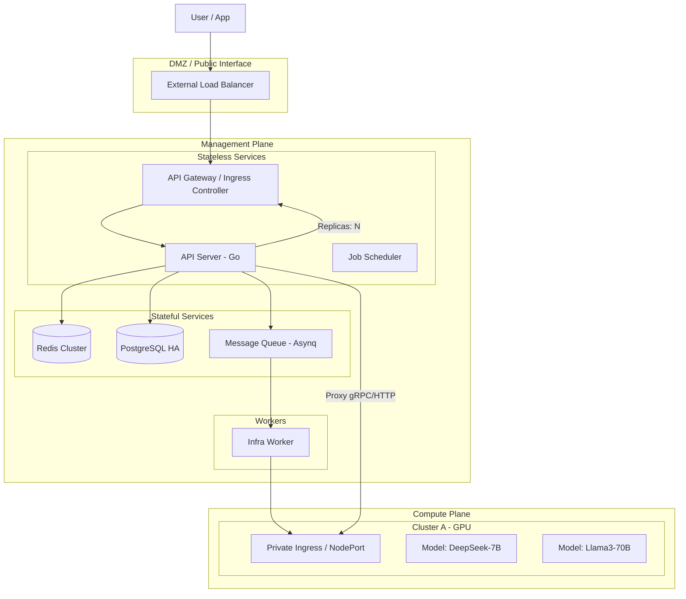
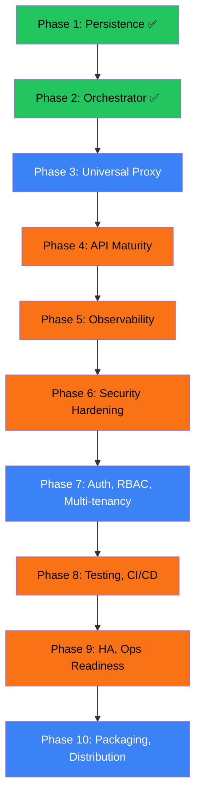

# OwnLLM: Enterprise Self-Hosted AI Platform Architecture

## 1. Executive Architecture Overview

OwnLLM is architected as a **Distributed System** designed for on-premise or private-cloud installation. It decouples the **Control Plane** (Management) from the **Data Plane** (Inference execution) to ensure scalability, security, and fault tolerance.

> **Architecture Decisions — Informed by Competitive Research**
> Key design choices in this document are informed by analysis of production-grade platforms:
> - **n8n** (TypeScript, 50+ package monorepo): Custom DI container, Bull queue with priority & concurrency control, decorator-based config with Zod validation, typed event system with relay pattern, comprehensive test coverage at every layer.
> - **Coolify** (PHP/Laravel monolith): DB-backed deployment queue for durability & audit, server-scoped concurrency limits, real-time deployment log streaming. Anti-patterns we avoid: 4000+ line god classes, sparse testing, trait-based code sharing.
> - Full comparison: `Study/implementation/ARCHITECTURE_COMPARISON.md`.

### High-Level Components



## 2. Detailed Component Design

### 2.1 The Control Plane (Go Monolith/Microservices)

The core is a Go-based application designed for horizontal scaling.

*   **API Gateway / Router (`internal/http`)**:
    *   **Authentication Middleware**: Validates JWT/OIDC tokens.
    *   **Rate Limiter**: Token bucket info stored in Redis (`rate:org:{id}`).
    *   **Unified Proxy**: The heart of the inference path. Intercepts `/v1/chat/completions`, parses the body, and routes to the correct internal cluster.
*   **Job Scheduler (`internal/scheduler`)**:
    *   Managing generic cron jobs (billing aggregation, health checks).
    *   Reconciling cluster states (e.g., detecting if a remote cluster died).

### 2.2 Asynchronous Deployment Engine (The Queue)

We do not block HTTP requests for infrastructure operations.

*   **Technology**: `hibiken/asynq` (backed by Redis).
*   **Queues**:
    *   `critical`: Database writes, critical state updates.
    *   `infra-provision`: Pulumi/Terraform jobs (Long running, 5-20 mins).
    *   `model-deploy`: Helm chart deployments to K8s (Medium, 2-5 mins).
    *   `cleanup`: Resource destruction.
*   **Priority Support**: Use `asynq.Priority()` — rollbacks get higher priority (50) than normal deploys (100). *Pattern validated by n8n's Bull queue.*
*   **Concurrency Control**: Per-cluster concurrency limits prevent overwhelming target infrastructure. No more than N simultaneous deploys to the same cluster. *Pattern validated by Coolify's server-scoped concurrency.*
*   **Resiliency**:
    *   Atomic state transitions in Postgres (`Provisioning` -> `Installing` -> `Ready`).
    *   Dead Letter Queues (DLQ) for failed jobs requiring human intervention.

#### 2.2.1 DB-Backed Job Tracking (Durable State)

Asynq's Redis is ephemeral — a Redis restart loses all job history. We maintain a **durable `jobs` table** in Postgres as the source of truth for deployment history, audit, and progress streaming. *This is the #1 lesson from Coolify's architecture.*

**Deployment State Machine**:
```
QUEUED → IN_PROGRESS → BUILDING → DEPLOYING → RUNNING
                                             ↘ FAILED
                                             ↘ CANCELLED
```

Every state transition is written to the `jobs` table. Workers update state at each stage boundary, enabling:
- **Progress streaming** to the UI (via SSE or polling `GET /api/jobs/:id`).
- **Deployment history** — full audit trail of every deploy, who triggered it, duration, outcome.
- **Idempotent retries** — on worker crash, a new worker reads the last good state from DB.

### 2.3 The Inference Proxy & Load Balancing

How we route `POST /v1/chat/completions` without exposing backend IPs.

1.  **Incoming Request**: Client sends JSON body with `{"model": "deepseek-v2"}`.
2.  **Resolution (Cached)**:
    *   Check Redis `model:deepseek-v2`.
    *   If miss, query DB for `deployments` table, find Active replicas.
    *   **Round Robin** selection if multiple replicas exist across clusters.
3.  **Connection Pooling**:
    *   The Go Proxy maintains persistent HTTP/2 connections to the Private Ingress of the target Cluster to avoid TCP handshake overhead.
4.  **Response Streaming**:
    *   Server-Sent Events (SSE) are piped directly from the Model Pod -> Private Ingress -> Go Proxy -> User.

### 2.4 Caching Strategy

Multi-layer caching to ensure "Enterprise" speed.

*   **L1: In-Memory (Go)**:
    *   JWKS keys (for token validation).
    *   Feature Flags.
*   **L2: Redis (Shared)**:
    *   **Session State**: User login sessions.
    *   **Routing Table**: `ModelID -> [ClusterIP:Port, ClusterIP:Port]`. TTL: 5 minutes.
    *   **Cost/Quota**: Real-time token usage counters (`tokens:org:{id}:month`).
    *   **Semantic Cache (Future)**: Cache common QA pairs (e.g., "What is Kubernetes?") to return instant answers without hitting the GPU.

## 3. Data Schema (PostgreSQL)

Designed for Multi-Provider storage.

```sql
-- Organizations (Tenants)
CREATE TABLE organizations (
    id UUID PRIMARY KEY,
    name VARCHAR(255),
    quota_gpu_count INT DEFAULT 0,
    quota_budget_usd DECIMAL(10, 2),
    created_at TIMESTAMP
);

-- Infrastructure Clusters
CREATE TABLE clusters (
    id UUID PRIMARY KEY,
    org_id UUID REFERENCES organizations(id),
    provider VARCHAR(50), -- 'azure', 'aws', 'vsphere'
    region VARCHAR(100),
    vpc_config JSONB, -- Private IP ranges, Peering IDs
    kubeconfig_encrypted TEXT, -- AES-GCM Encrypted
    status VARCHAR(50), -- 'provisioning', 'active', 'draining'
    last_heartbeat TIMESTAMP
);

-- AI Deployments (The Models)
CREATE TABLE deployments (
    id UUID PRIMARY KEY,
    cluster_id UUID REFERENCES clusters(id),
    model_name VARCHAR(255), -- 'deepseek-coder-7b'
    replicas INT DEFAULT 1,
    endpoint_type VARCHAR(50), -- 'internal-svc', 'nodeport'
    internal_dns VARCHAR(255), -- 'vllm.default.svc.cluster.local'
    port INT,
    status VARCHAR(50)
);

-- Job Tracking (Durable deployment state — see §2.2.1)
CREATE TABLE jobs (
    id UUID PRIMARY KEY,
    type VARCHAR(50) NOT NULL,      -- 'provision', 'deploy', 'destroy'
    status VARCHAR(30) NOT NULL DEFAULT 'queued',  -- state machine: queued/in_progress/building/deploying/running/failed/cancelled
    priority INT NOT NULL DEFAULT 100,  -- lower = higher priority (50=rollback, 100=normal)
    payload JSONB NOT NULL,          -- typed task payload (cluster_id, model_name, etc.)
    result JSONB,                    -- outcome data (IP, error message, etc.)
    asynq_task_id VARCHAR(255),      -- correlation to Asynq for cancellation
    triggered_by UUID,               -- user_id or 'system'
    cluster_id UUID REFERENCES clusters(id),
    started_at TIMESTAMP,
    completed_at TIMESTAMP,
    error TEXT,
    created_at TIMESTAMP DEFAULT NOW(),
    updated_at TIMESTAMP DEFAULT NOW()
);
CREATE INDEX idx_jobs_status ON jobs(status);
CREATE INDEX idx_jobs_cluster ON jobs(cluster_id);
CREATE INDEX idx_jobs_type_status ON jobs(type, status);

-- Audit Trail (Compliance)
CREATE TABLE audit_logs (
    id UUID PRIMARY KEY,
    user_id UUID,
    action VARCHAR(255), -- 'provision_cluster', 'chat_inference'
    resource_id UUID,
    metadata JSONB,
    created_at TIMESTAMP DEFAULT NOW()
);
```

## 4. Production Readiness Checklist

### 4.1 Networking (Private Link)
*   **Requirement**: Management Plane must reach Compute Plane without public IPs.
*   **Implementation**:
    *   **AWS**: VPC Peering or Transit Gateway.
    *   **Azure**: VNet Peering.
    *   **On-Prem**: Routable Subnets.
    *   **Fallback**: WireGuard Mesh (Tailscale/Netmaker) installed as sidecars on Management Node and K8s Nodes.

### 4.2 Observability
*   **Metrics**: API exposes `/metrics` (Prometheus format).
    *   `http_requests_total{method, path, status}`
    *   `http_request_duration_seconds{method, path}`
    *   `asynq_tasks_processed_total{queue, status}`
    *   `model_inference_latency_seconds{model}`
    *   `gpu_utilization` (scraped from K8s via DCGM-Exporter).
*   **Logs**: JSON structured logging (`log/slog`) with correlation IDs. Ship to Loki or ELK.
*   **Tracing** (Optional): OpenTelemetry spans across API → Queue → Worker → K8s.
*   **Health Probes**:
    *   `/healthz` — liveness (process alive).
    *   `/readyz` — readiness (DB + Redis + Asynq reachable).

### 4.3 High Availability
*   **Database**: Postgres with Repmgr/Patroni (Leader/Follower).
*   **Control Plane**: Run 3+ replicas of the Go API behind a Load Balancer.
*   **Queues**: Redis Sentinel for failover.
*   **Circuit Breakers**: Proxy path must degrade gracefully when compute clusters are unhealthy.

### 4.4 Security
*   **Encryption at Rest**: Kubeconfig and secrets encrypted with AES-256-GCM before storage.
*   **Encryption in Transit**: TLS enforced on all internal connections (DB, Redis, inter-service).
*   **Input Validation**: Strict schema validation on all API inputs.
*   **Rate Limiting**: Token bucket per org in Redis.
*   **Dependency Scanning**: `govulncheck` integrated into CI pipeline.
*   **Security Headers**: HSTS, X-Content-Type-Options, X-Frame-Options.

### 4.5 Testing & Quality
*   **Unit Test Coverage**: >80% on business logic (store, handlers, workers).
*   **Interface-Based Mocking**: Define interfaces at all boundaries (`store.Store`, `worker.Queuer`, `kube.Deployer`) to enable clean test doubles without external dependencies. *n8n uses `Container.set(ServiceClass, mock)` via DI; Go achieves this natively via interfaces.*
*   **Table-Driven Tests**: Idiomatic Go test style for comprehensive input/output coverage.
*   **Integration Tests**: `testcontainers-go` for real Postgres + Redis in CI.
*   **E2E Tests**: Automated smoke test suite covering full provision → deploy → inference → cleanup flow.
*   **Load Tests**: k6/vegeta scripts establishing latency baselines.

### 4.6 Operational Readiness
*   **Graceful Shutdown**: SIGTERM handling with in-flight request draining on both API and worker. Use `signal.NotifyContext()` with `context.Context` propagation.
*   **Structured Error Types**: `internal/apierror` package with typed errors, consistent JSON envelope, and custom Echo error handler. *n8n pattern: typed error classes. Coolify pattern: global `handleError()`. Ours: typed errors + Echo centralised handler.*
*   **API Versioning**: All routes under `/api/v1/` from day one. Non-breaking additions are free; breaking changes go to `/api/v2/`.
*   **Route Groups with Middleware**: Authentication, rate limiting, request ID injection, and logging organized as middleware chains per route group — not globally.
*   **Request Validation**: `go-playground/validator` with Echo binder for strict payload validation at the boundary. No raw user input reaches business logic unchecked.
*   **Database Migrations**: Automated via golang-migrate/goose. No manual SQL.
*   **DB-Backed Job Tracking**: `jobs` table (§3) provides durable deployment state, progress streaming, and deployment history. Workers update status at each stage.
*   **Audit Trail**: All state-mutating operations logged to `audit_logs` table.
*   **Config Validation**: Startup fails immediately with clear messages on missing required config. Support `_FILE` suffix for K8s/Docker secret files.
*   **Runbooks**: Operator documentation for common incidents.
*   **Backup/Restore**: Automated Postgres backup with tested restore procedure.

## 5. Implementation Roadmap


*Green = Complete, Blue = Originally Planned, Orange = New (Enterprise Gap Fills)*

---

### Phase 1: Persistence Foundation ✅
*   Setup `internal/store` (Postgres with `pgx/v5` connection pool).
*   Setup `internal/cache` (Redis with `go-redis/v9`).
*   Define data models, migrations, and Store interface.
*   Wire into application via dependency injection.

### Phase 2: The Orchestrator Core ✅
*   Implement `internal/worker` with `hibiken/asynq`.
*   Move Provision/Deploy/Destroy into background jobs.
*   HTTP endpoints return `202 Accepted` with job metadata.
*   Separate `cmd/worker/main.go` process.
*   `GET /api/jobs/:id` for task status visibility.
*   Deterministic task IDs for idempotency.

### Phase 3: The Universal Proxy
*   Implement model-aware routing on `POST /v1/chat/completions`.
*   Redis-first service discovery with Postgres fallback.
*   Round-robin target selection across active replicas.
*   Streaming-safe reverse proxy (SSE passthrough).
*   Graceful handling of cache miss, Redis down, and unknown model.

### Phase 4: API Maturity & Reliability *(NEW — Informed by Competitive Research)*
Critical foundations that every production API requires before adding more features. Every item here was validated as table-stakes by studying n8n and Coolify's production architectures.

*   **Graceful Shutdown**: Signal handling (SIGTERM/SIGINT) on API server and worker with in-flight request draining. Use `context.Context` propagation to all long-running operations. *n8n uses `@OnShutdown(HIGHEST_SHUTDOWN_PRIORITY)` decorator; we use Go's signal.NotifyContext.*
*   **Structured Error Types** (`internal/apierror`): Typed error package replacing raw strings. Every error has a code, message, and optional details. Custom Echo error handler ensures consistent JSON responses.
    ```go
    // internal/apierror/errors.go
    type APIError struct {
        Code       string `json:"code"`
        Message    string `json:"message"`
        StatusCode int    `json:"-"`
        Details    any    `json:"details,omitempty"`
        RequestID  string `json:"request_id,omitempty"`
    }
    var ErrClusterNotFound = &APIError{Code: "CLUSTER_NOT_FOUND", StatusCode: 404}
    ```
    *n8n uses typed error classes (`UnexpectedError`, `UserError`); Coolify uses a global `handleError()` helper. We take n8n's approach.*
*   **Route Groups & Middleware**: Organize routes with middleware chains instead of flat registration.
    ```go
    api := e.Group("/api", requestIDMiddleware, loggerMiddleware)
    v1 := api.Group("/v1", authMiddleware, rateLimitMiddleware)
    v1.POST("/provision", provisionHandler.Handle)
    v1.POST("/deploy", deployHandler.Handle)
    ```
*   **API Versioning**: All routes under `/api/v1/` from day one. Breaking changes go to `/api/v2/`.
*   **Request Validation**: Use `go-playground/validator` with Echo's built-in binder for strict payload validation on all endpoints. *Both n8n (Zod) and Coolify (Laravel validation) validate at the boundary — we must too.*
*   **Request ID Middleware**: Generate and propagate correlation IDs through handlers, workers, and logs.
*   **Database Migration Runner**: Integrate `golang-migrate` or `goose` for automated, versioned schema evolution. No more manual SQL execution.
*   **DB-Backed Job Tracking**: Implement `jobs` table (defined in Section 3 schema) to give deployments durable state, progress streaming, and history. Workers update job status at each stage boundary. *Core lesson from Coolify — their `ApplicationDeploymentQueue` table is the deployment source of truth.*
*   **Audit Logging**: Implement `audit_logs` table (defined in Section 3 schema) and write-through logging on all state-mutating operations.
*   **Pagination**: Cursor-based pagination on all list endpoints (`GET /api/v1/clusters`, `GET /api/v1/deployments`, `GET /api/v1/jobs`).
*   **Config Validation**: Fail-fast on startup if required config is missing or malformed. Support `_FILE` suffix for K8s/Docker secret files (e.g., `DATABASE_URL_FILE=/run/secrets/db-url`). Consider `caarlos0/env` for struct-tag-based env parsing.
*   **Domain Service Layer**: Group handler dependencies into domain services instead of passing many params:
    ```go
    // internal/provision/service.go — encapsulates provision logic
    type Service struct { store store.Store; queue *worker.Client; kube *kube.Client }
    ```
    *This keeps `app.New()` from becoming a 20-parameter constructor. n8n has ~40+ injectable services; we group ours by domain.*
*   **OpenAPI Specification**: Auto-generate or maintain API docs for consumers.

### Phase 5: Observability *(NEW — Informed by Competitive Research)*
Without observability, production incidents are blind debugging. *n8n has a full event bus with typed events and relay pattern; Coolify streams deployment logs to a DB table for real-time UI. We need both patterns.*
*   **Event System**: Define typed internal events (`provision.started`, `deploy.completed`, `job.failed`) with a simple channel-based pub/sub. Relays can forward to external destinations (webhooks, log aggregators). *Modeled after n8n's `EventService.emit()` + `EventRelay` pattern.*
*   **Deployment Log Streaming**: Workers write structured log entries to the `jobs` table during execution. The API serves them via SSE on `GET /api/v1/jobs/:id/logs`. *Modeled after Coolify's `addLogEntry()` pattern.*
*   **Prometheus Metrics**: `/metrics` endpoint exposing:
    *   `http_requests_total{method, path, status}`
    *   `http_request_duration_seconds{method, path}`
    *   `asynq_tasks_processed_total{queue, status}`
    *   `asynq_queue_depth{queue}`
    *   `model_inference_latency_seconds{model}`
    *   `gpu_utilization` (scraped from compute clusters via DCGM-Exporter).
*   **Structured Logging Enrichment**: Every log line includes `request_id`, `org_id`, `cluster_id` where applicable. Ship to Loki/ELK.
*   **Health Endpoints**:
    *   `/healthz` — liveness (is the process alive?).
    *   `/readyz` — readiness (are DB + Redis + queue backends reachable?).
*   **Worker Heartbeat Monitoring**: Detect stale/dead workers, surface in dashboard.
*   **OpenTelemetry Tracing** (Optional): Distributed traces across API → Queue → Worker → K8s.

### Phase 6: Security Hardening *(NEW)*
Enterprise customers require security controls before any auth/RBAC layer is meaningful.
*   **Kubeconfig Encryption at Rest**: AES-256-GCM encryption in the store layer. Key sourced from env var or HashiCorp Vault.
*   **TLS Everywhere**: Enforce TLS on API ↔ Redis, API ↔ Postgres, API ↔ Compute Cluster connections.
*   **Input Validation & Sanitization**: Strict validation on all request payloads to prevent injection attacks.
*   **Rate Limiting Middleware**: Token bucket algorithm backed by Redis (`rate:org:{id}`), as described in Section 2.1.
*   **CORS Policy**: Configurable allowed origins.
*   **Security Headers**: HSTS, X-Content-Type-Options, X-Frame-Options via middleware.
*   **Secrets Rotation Support**: Design for key rotation without restarts (watch pattern or periodic reload).
*   **Dependency Scanning**: `govulncheck` in CI to catch known CVEs.

### Phase 7: Auth, RBAC & Multi-tenancy
*   **OIDC Integration**: Pluggable identity provider interface (Keycloak, Auth0, Azure AD).
*   **RBAC Middleware**: Role-based route guards (`admin`, `operator`, `viewer`).
*   **Org-Scoped Isolation**: All data queries filtered by `org_id`. No cross-tenant data leakage.
*   **API Key Management**: Programmatic access tokens for CI/CD and automation.
*   **Resource Quotas**: Per-org GPU count limits, budget caps (`quota_gpu_count`, `quota_budget_usd`).
*   **Noisy-Neighbor Protection**: Per-org rate limits and queue priority separation.

### Phase 8: Testing & CI/CD *(NEW — Informed by Competitive Research)*
Zero tests = zero confidence = zero enterprise credibility. *Coolify's sparse testing leads to constant regressions — a cautionary example. n8n's Jest + Playwright + test containers strategy is the gold standard.*
*   **Unit Tests**: Store layer, handler logic, worker processors, proxy routing. Target **>80% coverage**.
    *   Use **interface-based mocking** — `store.Store`, `worker.Queuer`, `kube.Deployer` interfaces enable clean test doubles.
    *   **Table-driven tests** (idiomatic Go) for all business logic.
    *   Test HTTP handlers with `httptest.NewRecorder()` + real handler instances with mock deps.
    *   *n8n uses `Container.set(ServiceClass, mock)` for DI-based mocking; we use interface injection natively in Go.*
*   **Integration Tests**: Use `testcontainers-go` for real Postgres + Redis in tests.
*   **E2E Smoke Tests**: Automated version of manual curl tests (provision → deploy → proxy → cleanup).
*   **Dockerfile**: Multi-stage build with distroless/scratch base. Separate images for API server and worker.
*   **CI Pipeline** (GitHub Actions / GitLab CI):
    *   `lint` → `vet` → `govulncheck` → `test` → `build` → `push image` → `deploy staging`.
*   **Load Testing**: k6 or vegeta scripts to establish latency baselines and breaking points.
*   **Release Strategy**: Semantic versioning, tagged releases, changelog generation.

### Phase 9: HA & Operational Readiness *(NEW)*
Single-instance anything is a non-starter for enterprise SLAs.
*   **Stateless API Scaling**: Horizontal pod autoscaler behind load balancer.
*   **Redis HA**: Sentinel mode for automatic failover (or Redis Cluster for sharding).
*   **Postgres HA**: Patroni or Repmgr for leader election and streaming replication.
*   **Connection Resilience**: Exponential backoff + retry on DB/Redis connection failures at startup and runtime.
*   **Circuit Breakers**: On the proxy path to prevent cascade failures when a compute cluster is unhealthy.
*   **Database Backup Strategy**: Automated pg_dump or WAL archiving to object storage. Tested restore procedure.
*   **Runbooks**: Operator documentation for common incidents (worker stuck, queue backup, cluster unreachable).
*   **Disaster Recovery Playbook**: RTO/RPO targets, failover procedures, data recovery steps.

### Phase 10: Packaging, Licensing & Distribution
*   Implement `internal/license` package:
    *   BSL 1.1 license file in repo root.
    *   Offline JWT validation with embedded public key.
    *   Tier detection: `community` (no key) / `pro` / `enterprise`.
    *   Feature flag interface: `features.IsEnabled("sso")` — clean gating, not scattered `if licensed` checks.
*   Implement `internal/features` package:
    *   Central feature registry mapping tier → enabled features.
    *   Middleware integration for gated routes.
    *   Graceful degradation: unlicensed = community features, not broken.
*   Create Helm Chart structure (`charts/ai-paas-manager`) with production-grade `values.yaml` (resource limits, PDBs, HPA).
*   Multi-stage Dockerfile (from Phase 8) integrated into chart.
*   Add "Airgap Mode" flag to skip public internet checks.
*   Installation verification CLI tool.
*   Customer onboarding documentation and quickstart guide.

## 6. Distribution Model: Source-Available Open Core

OwnLLM follows the **open-core** model: all source code is publicly visible, the Community tier is fully functional for single-team use, and advanced features are unlocked via a paid license key. This mirrors companies like HashiCorp (Terraform), Sentry, and n8n.

> **Important**: OwnLLM is **source-available**, not "open source" in the OSI sense.
> The license restricts offering OwnLLM as a competing managed service.

### 6.1 License: Business Source License 1.1 (BSL)

The repository ships under **BSL 1.1** with the following parameters:

| BSL Parameter | Value |
|---|---|
| **Licensor** | OwnLLM Inc. (or project maintainer) |
| **Licensed Work** | OwnLLM (all code in this repository) |
| **Additional Use Grant** | You may use the Licensed Work for any purpose **except** offering it to third parties as a managed service that competes with OwnLLM. |
| **Change License** | Apache License 2.0 |
| **Change Date** | 4 years from each release date |

**What this means in practice**:
*   Anyone can read, fork, build, and self-host OwnLLM internally. ✅
*   Enterprises can modify the code for internal use. ✅
*   Nobody can take the code and sell "Managed OwnLLM" as a cloud product. ❌
*   After 4 years, each version automatically becomes Apache 2.0 (true OSS). ✅
*   The JWT license check in code is a **UX convenience** (graceful tier detection), not the legal enforcement — BSL terms are.

### 6.2 Tier & Feature Gating

```mermaid
graph LR
    subgraph Community ["Community - Free"]
        C1[Single Cluster]
        C2[Model Deploy/Proxy]
        C3[Job Queue]
        C4[Health/Metrics]
        C5[CLI]
    end
    subgraph Pro ["Pro - Paid"]
        P1[Multi-Cluster]
        P2[SSO / OIDC]
        P3[Audit Trail]
        P4[Advanced Dashboards]
        P5[Email Support]
    end
    subgraph Enterprise ["Enterprise - Paid"]
        E1[Multi-Tenancy + RBAC]
        E2[GPU Quota Mgmt]
        E3[Kubeconfig Encryption]
        E4[Airgap Mode]
        E5[SLA + Dedicated Support]
    end

    Community -->|"License Key"| Pro
    Pro -->|"License Key"| Enterprise
```



#### Community (No License Key Required)
The full product for single-team, single-cluster AI infrastructure. This is the **adoption engine**.
*   Single GPU cluster provisioning & management.
*   Model deployment (vLLM) with background job orchestration.
*   Inference proxy (`POST /v1/chat/completions`).
*   Postgres persistence + Redis caching.
*   Job queue with status endpoint.
*   Basic `/healthz` and Prometheus `/metrics`.
*   `max_clusters: 1`, no user/time limits.

#### Pro ($)
For teams outgrowing a single cluster.
*   Everything in Community, plus:
*   **Multi-cluster management** — provision across regions/providers.
*   **SSO / OIDC integration** (Keycloak, Azure AD, Okta).
*   **Audit trail** — all mutations logged to `audit_logs` (compliance trigger = purchase trigger).
*   **Advanced observability** — pre-built Grafana dashboards, alerting rules.
*   Priority email support.
*   `max_clusters: 5`.

#### Enterprise ($$)
For organizations with compliance, scale, and multi-tenant needs.
*   Everything in Pro, plus:
*   **Multi-tenancy** — org-scoped resource isolation, no cross-tenant data leakage.
*   **RBAC** — `admin`, `operator`, `viewer` role-based route guards.
*   **GPU quota management** — per-org GPU count limits and budget caps.
*   **Custom rate limits** — per-tenant throttling.
*   **Kubeconfig encryption at rest** (AES-256-GCM — compliance checkbox).
*   **Airgap mode** — fully disconnected installation support.
*   **Certified Helm charts** with HA configuration.
*   Dedicated Slack channel + SLA.
*   `max_clusters: unlimited`.

### 6.3 License Enforcement Architecture

The license system is designed as a **clean interface**, not scattered conditionals.

```go
// internal/features/features.go
type Tier string
const (
    TierCommunity  Tier = "community"
    TierPro        Tier = "pro"
    TierEnterprise Tier = "enterprise"
)

type Feature string
const (
    FeatureMultiCluster  Feature = "multi_cluster"
    FeatureSSO           Feature = "sso"
    FeatureAuditLog      Feature = "audit_log"
    FeatureRBAC          Feature = "rbac"
    FeatureMultiTenancy  Feature = "multi_tenancy"
    FeatureEncryption    Feature = "encryption_at_rest"
    FeatureAirgap        Feature = "airgap"
    FeatureGPUQuotas     Feature = "gpu_quotas"
)

// Central registry — single source of truth
var tierFeatures = map[Tier][]Feature{
    TierCommunity:  {},  // base features always on
    TierPro:        {FeatureMultiCluster, FeatureSSO, FeatureAuditLog},
    TierEnterprise: {FeatureMultiCluster, FeatureSSO, FeatureAuditLog,
                     FeatureRBAC, FeatureMultiTenancy, FeatureEncryption,
                     FeatureAirgap, FeatureGPUQuotas},
}

func IsEnabled(tier Tier, f Feature) bool { ... }
```

**License JWT Payload** (signed with Ed25519):
```json
{
  "sub": "org-uuid",
  "tier": "pro",
  "max_clusters": 5,
  "features": ["multi_cluster", "sso", "audit_log"],
  "iat": 1739500000,
  "exp": 1771036000
}
```

**Validation Flow**:
1.  On startup, read `LICENSE_KEY` env var.
2.  If empty → `TierCommunity`. No errors, fully functional single-cluster mode.
3.  If present → Validate JWT signature using embedded Ed25519 public key.
4.  Decode tier + feature list + `max_clusters` + expiry.
5.  Inject into `features.Manager` (available via dependency injection to all handlers/workers/middleware).
6.  **Middleware example**: OIDC routes return `403 {"error": "SSO requires a Pro license"}` if `!features.IsEnabled("sso")`.
7.  **Provisioner example**: Returns `402 {"error": "Cluster limit reached (1/1). Upgrade to Pro."}` if `cluster_count >= max_clusters`.

**Design principles**:
*   License check is a **UX feature** (graceful degradation), not a security boundary. BSL terms are the legal enforcement.
*   No feature should crash or silently fail when unlicensed — always a clear message with upgrade path.
*   The `features.IsEnabled()` interface keeps gating logic out of business logic.

### 6.4 Helm Charts (Self-Hosted Delivery)

The entire Management Plane is packaged as a Helm Chart for enterprise installation.

*   **Chart Structure**:
    *   `charts/ai-paas-manager/` (Parent Chart)
        *   `templates/deployment.yaml` (Go Control Plane)
        *   `templates/worker-deployment.yaml` (Asynq Worker)
        *   `templates/configmap.yaml` (Runtime config)
        *   `templates/secret.yaml` (License key, DB creds)
        *   `templates/hpa.yaml` (Horizontal Pod Autoscaler)
        *   `templates/pdb.yaml` (Pod Disruption Budget)
        *   `values.yaml` (DB, Redis, License Key, Airgap, resource limits)
    *   **Dependencies**:
        *   `postgresql` (Bitnami)
        *   `redis` (Bitnami)
        *   `monitoring-stack` (Optional: Prom/Grafana)

## 7. Implementation Status & Gap Tracker

Tracks what exists in code today vs. what the architecture requires.

| Concern | Architecture Requirement | Code Reality | Phase |
|---|---|---|---|
| Postgres persistence | pgx/v5 pool, Store interface | ✅ Implemented | 1 |
| Redis caching | go-redis/v9 | ✅ Implemented | 1 |
| DB migrations | Automated runner | ⚠️ Manual SQL only | 4 |
| Async job queue | Asynq client/server/queues | ✅ Implemented | 2 |
| Queue priority weights | Weighted queue processing | ✅ Implemented in `asynq.Config` (`critical:10`, `infra-provision:6`, `model-deploy:6`, `cleanup:4`) | 2 |
| Worker process | Separate cmd/worker | ✅ Implemented | 2 |
| Worker graceful shutdown | SIGTERM handling on worker | ✅ Implemented via `signal.NotifyContext` in `cmd/worker/main.go` | 2 |
| Non-blocking provision/deploy | 202 + job metadata | ✅ Implemented | 2 |
| Job status endpoint | GET /api/jobs/:id | ✅ Implemented | 2 |
| Pulumi integration | Programmatic infra provision/destroy | ✅ Implemented via Pulumi Automation API | 2 |
| SSH kubeconfig fetch | Fetch remote kubeconfig after provision | ✅ Implemented with retry loop in worker | 2 |
| Kubernetes model deploy | Deploy model-serving workload and service | ✅ Implemented with init-container + NodePort service | 2 |
| DLQ visibility | Failed job inspection | ⚠️ Basic (no dedicated endpoint) | 2 |
| **DB-backed job tracking** | **`jobs` table for durable state** | **❌ Redis-only (ephemeral)** | **4** |
| **Deployment state machine** | **QUEUED→BUILDING→DEPLOYING→RUNNING/FAILED** | **⚠️ Partial: basic `installing` → `active` / `failed` transitions exist on cluster/deployment records, but no durable jobs state machine** | **4** |
| **Per-cluster concurrency** | **Limit concurrent ops per cluster** | **❌ Global worker concurrency only; no per-cluster throttling** | **4** |
| **Structured error types** | **`internal/apierror` package** | **❌ Raw strings + maps** | **4** |
| **Route groups + middleware** | **Grouped routes with auth/rate-limit chains** | **❌ Flat route registration** | **4** |
| **API versioning** | **`/api/v1/` prefix on all routes** | **❌ Unversioned paths** | **4** |
| **Request validation** | **`go-playground/validator` on all payloads** | **❌ Minimal field checks** | **4** |
| **Domain service layer** | **Group deps into domain services** | **❌ Handler-level wiring only** | **4** |
| **Config validation + _FILE** | **Fail-fast startup + K8s secret file support** | **❌ Silent empty defaults** | **4** |
| Model-aware proxy routing | Parse model → resolve → proxy | ✅ Implemented | 3 |
| Service discovery | Redis-first + DB fallback | ✅ Implemented | 3 |
| API server graceful shutdown | SIGTERM + request draining | ❌ Not implemented | 4 |
| Error response format | Consistent JSON envelope | ❌ Mixed (strings + maps; proxy has its own envelope) | 4 |
| Request ID / correlation | Middleware + propagation | ❌ Not implemented | 4 |
| Audit trail | audit_logs table + writes | ❌ Table missing, no logging | 4 |
| Pagination | Cursor-based list endpoints | ❌ No list endpoints exist | 4 |
| **Progress streaming** | **SSE/polling for deploy progress** | **❌ Not implemented** | **4** |
| Prometheus metrics | /metrics endpoint | ❌ Not implemented | 5 |
| Health probes | /healthz + /readyz | ⚠️ `/healthz` exists (basic); `/readyz` missing | 5 |
| **Event system** | **Typed internal events + relay** | **❌ Not implemented** | **5** |
| Kubeconfig encryption | AES-256-GCM at rest | ❌ Stored as plaintext | 6 |
| SSH host key verification | Strict SSH host checking | ❌ `ssh.InsecureIgnoreHostKey()` still used | 6 |
| TLS internal | DB/Redis/cluster connections | ❌ Plaintext DB/Redis connections; remote kube client disables TLS verification | 6 |
| Rate limiting | Token bucket in Redis | ❌ Not implemented | 6 |
| Input validation | Schema validation layer | ❌ Minimal field checks only | 6 |
| Auth / OIDC | JWT/OIDC middleware | ❌ Not implemented | 7 |
| RBAC | Role-based route guards | ❌ Not implemented | 7 |
| Multi-tenant isolation | org_id scoped queries | ⚠️ `org_id` exists in schema, but runtime uses default org only | 7 |
| Unit tests | >80% coverage | ❌ Zero tests | 8 |
| **Interface-based mocking** | **Interfaces on queue, kube boundaries** | **⚠️ Only `store.Store` exists; queue and kube still use concrete types** | **8** |
| Dockerfile | Multi-stage build | ❌ Not created | 8 |
| CI/CD pipeline | Lint/test/build/push | ❌ Not created | 8 |
| HA topology | Multi-replica, Sentinel | ❌ Single instance | 9 |
| Helm chart | Production values.yaml | ❌ Not created | 10 |
| License enforcement | BSL 1.1 + JWT tier detection | ❌ Not implemented | 10 |
| Feature flag system | `features.IsEnabled()` interface | ❌ Not implemented | 10 |
| Tier gating | Community/Pro/Enterprise split | ❌ Not implemented | 10 |

**Legend**: ✅ Complete | ⚠️ Partial | ❌ Not Started

*Last updated: 2026-03-28*
*Competitive research incorporated: n8n (TypeScript) + Coolify (PHP/Laravel) — see `Study/implementation/ARCHITECTURE_COMPARISON.md`*
